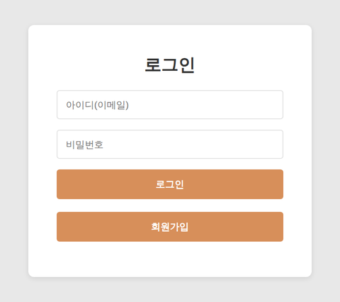
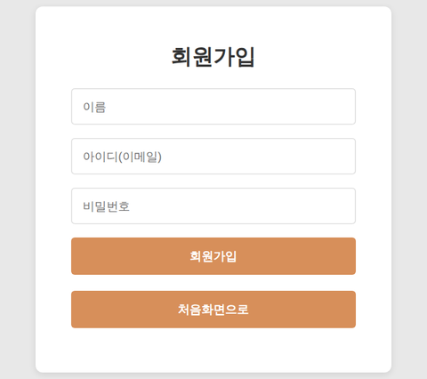
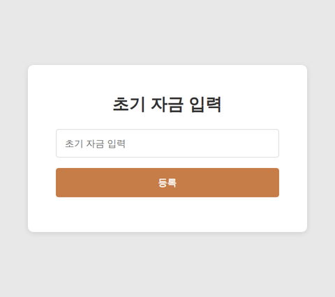
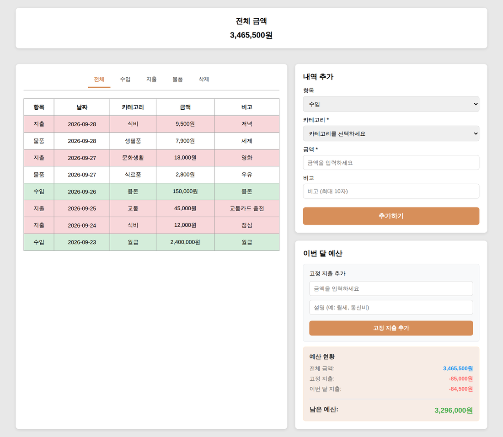
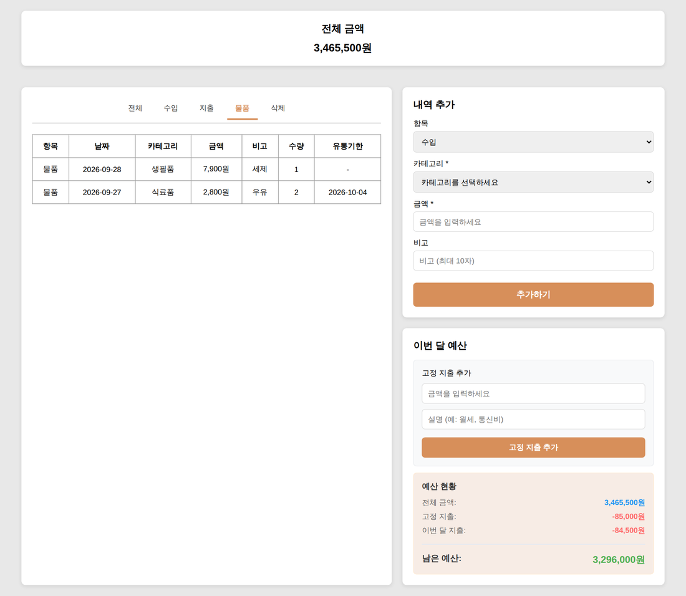
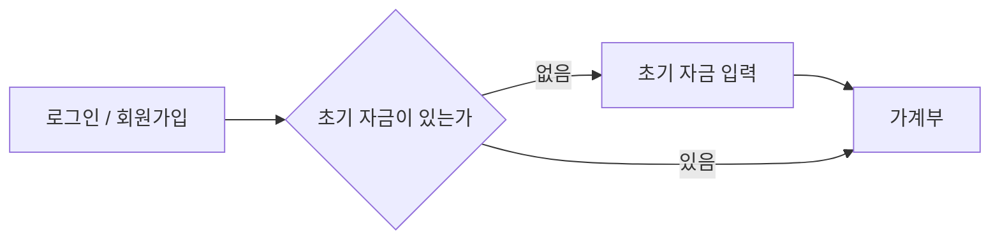

# 가계부 웹앱 (accountbook_react)

수입 · 지출 · 물품(유통기한 포함)을 기록하고, 고정 지출을 반영한 **이번 달 남은 예산**까지 한 화면에서 확인하는 개인 가계부 웹앱입니다.
React로 화면을 만들고, REST API로 서버와 통신해 사용자별 데이터를 저장하고 불러옵니다.

- 개발 기간: 2025.11.16 – 2025.12.16
- 팀 구성: 2명

## 화면

> 아래 화면은 샘플 데이터로 실행한 모습입니다.

| 로그인 | 회원가입 | 초기 자금 입력 |
|:---:|:---:|:---:|
|  |  |  |

**가계부 (전체 탭)** : 수입은 초록, 지출은 빨강 행으로 구분하고, 오른쪽에서 내역 추가와 이번 달 예산을 관리합니다.



**가계부 (물품 탭)** : 물품은 수량과 유통기한도 함께 기록합니다.



## 주요 기능

- **회원가입 / 로그인**: 이름, 이메일, 비밀번호로 가입하고 로그인합니다. 로그인하지 않으면 다른 화면에 접근할 수 없습니다.
- **초기 자금**: 처음 한 번 입력하며, 이미 잔액이 있으면 이 단계를 건너뜁니다.
- **내역 기록**: 수입 · 지출 · 물품을 카테고리별로 등록합니다. 물품은 수량과 유통기한을 추가로 입력합니다.
- **조회와 필터**: 전체 · 수입 · 지출 · 물품 탭으로 나눠 보고, 전체 목록에서는 수입/지출을 색으로 구분합니다.
- **삭제**: 삭제 탭에서 확인 창을 거쳐 내역을 삭제합니다.
- **전체 금액**: `초기 자금 + 수입 − 지출`을 화면 상단에 항상 표시합니다.
- **이번 달 예산**: 고정 지출(예: 월세, 통신비)을 등록하면 `전체 금액 − 고정 지출 − 이번 달 지출`로 남은 예산을 계산하고, 0보다 작으면 빨간색으로 표시합니다.

## 화면 흐름



## 기술 스택

| 구분 | 사용 기술 |
|---|---|
| 프론트엔드 | React 19, React Router 7, Axios, Create React App |
| 서버 (별도 실행) | Node.js, Express, MySQL |
| 통신 | REST API (JSON) |
| 서버 배포 | AWS EC2 |

## 폴더 구조

```
src/
├─ App.js                      # 라우팅과 로그인 상태 관리
├─ pages/
│  ├─ LoginPage.js             # 로그인 / 회원가입
│  ├─ InitialBalancePage.js    # 초기 자금 입력
│  └─ AccountBookPage.js       # 가계부 (내역, 예산)
├─ components/
│  ├─ Navbar.js
│  └─ TransactionTable.js
├─ App.css
└─ index.js
```

## API

프론트엔드에서 호출하는 API입니다.

| 기능 | 메서드 | 경로 |
|---|---|---|
| 로그인 | POST | `/user/login` |
| 회원가입 | POST | `/user/signup` |
| 초기 자금 조회 | GET | `/balance/:userId` |
| 초기 자금 등록 | POST | `/balance/init` |
| 카테고리 조회 | GET | `/category` |
| 수입 · 지출 · 물품 조회 | GET | `/transaction/{income\|expense\|item}/:userId` |
| 수입 · 지출 · 물품 등록 | POST | `/transaction/{income\|expense\|item}` |
| 수입 · 지출 · 물품 삭제 | DELETE | `/transaction/{income\|expense\|item}/:id` |
| 고정 지출 조회 | GET | `/fixed-expense/:userId` |
| 고정 지출 등록 | POST | `/fixed-expense` |

## 실행 방법

```bash
git clone https://github.com/seokwd/accountbook_react.git
cd accountbook_react
npm install
npm start
```

브라우저에서 <http://localhost:3000> 으로 접속합니다.

이 저장소에는 프론트엔드만 들어 있어서, 화면을 사용하려면 위 API를 제공하는 서버가 필요합니다.
서버 주소는 아래 세 파일의 `BASE_URL`에 적혀 있으니 본인의 서버 주소로 바꿔 주세요.

- `src/pages/LoginPage.js`
- `src/pages/InitialBalancePage.js`
- `src/pages/AccountBookPage.js`

## 팀

| 이름 | GitHub | 주요 작업 (커밋 기준) |
|---|---|---|
| 석원담 | [seokwd](https://github.com/seokwd) | 프로젝트 초기 세팅, 로그인 화면, 카테고리 · 수입 · 지출 · 물품 API 작성과 연동, 초기 자금 반영, 이번 달 예산과 전체 금액 |
| 손현준 | hyun joon | 회원가입, 가계부 화면, 필터와 색상 구분, 삭제 기능, DB 연동 오류 해결과 사용자별 데이터 분리 |

## 개선 계획

- **API 주소 분리**: 서버 주소를 각 페이지 코드에서 빼고 환경 변수(`.env`)로 관리
- **로그인 상태 유지**: 새로고침해도 로그인이 풀리지 않도록 토큰 또는 세션 저장 방식 도입
- **코드 구조 정리**: 600줄 규모의 `AccountBookPage.js`를 화면 조각과 API 호출 함수로 분리
